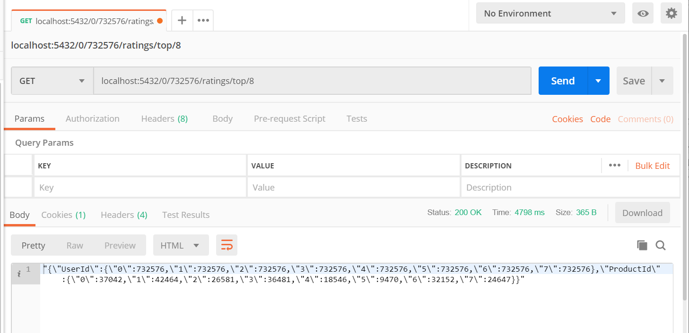
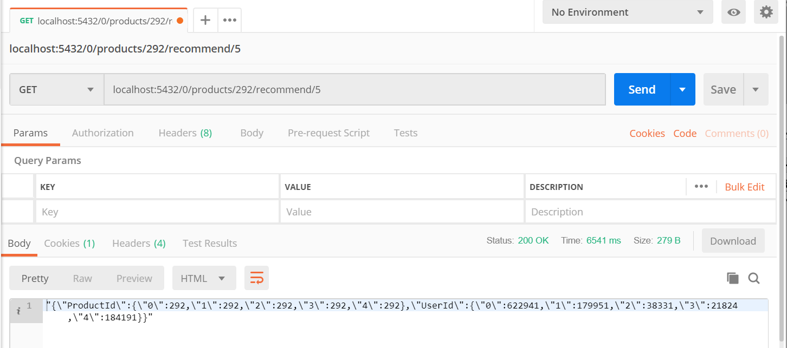
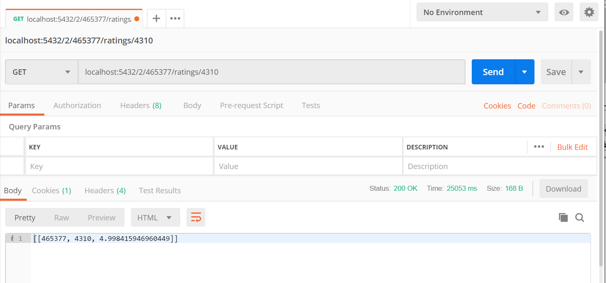

# big_data_final_project_133

## producer.py
yang fungsinya akan mengirim data ke comsumer

## comsumer.py
yang fungsinya akan menerima data dari producer dan akan menyipannya dalam bentuk batch

## server.py
fungsinya untuk menjalankan endpoint API, dan untuk menjalankan engine dan app

## app.py
fungsinya untuk mengatur routing an

## engine.py
Untuk inisialisasi spark, untuk menjalankan webserver, untuk memanggil app.py dan engine.py, dan setting dataset location

jumlah data = 300.000 data/batch
rentang waktu yang diterima = 0.00000000000000001

## model 
1. Model 1: 300.000 data pertama.
2. Model 2: 300.000 data kedua.
3. Model 3: 300.000 data ketiga.

## akses API
dengan menjalankan localhost (0.0.0.0) dengan port tertentu

## step by step menjalankan system
1. jalankan zookeeper dengan mengetikkan syntax zkserver
2.membuat topik di kafka dengan syntax
```
kafka-topics.bat — create — zookeeper localhost:2181 — replication-factor 1 — partitions 1 — topic home-kitchen
```
3.menjalankan producer.py di spyder
4.menjalankan consumer.py spyder
5.setelah itu konsumer akan menerima data
6.menjalankan server.py untuk mengtrain data dan mengakses API

## API REQUEST
1.memberikan rekomendasi produk sesuai dengan user<br>http://localhost:/<model_id>/<user_id>/ratings/top/<count_num>
<br>


2.<br>menampilkan user yang paling di rekomendasikan berdasarkan produk<br>http://localhost:/<int:model>/products/<int:product_id>/recommend/<int:count>
<br>


3.menampilkan user tersebut merating produk tertentu<br>http://localhost:/<int:model>/<int:user_id>/ratings/<int:product_id>
<br>


